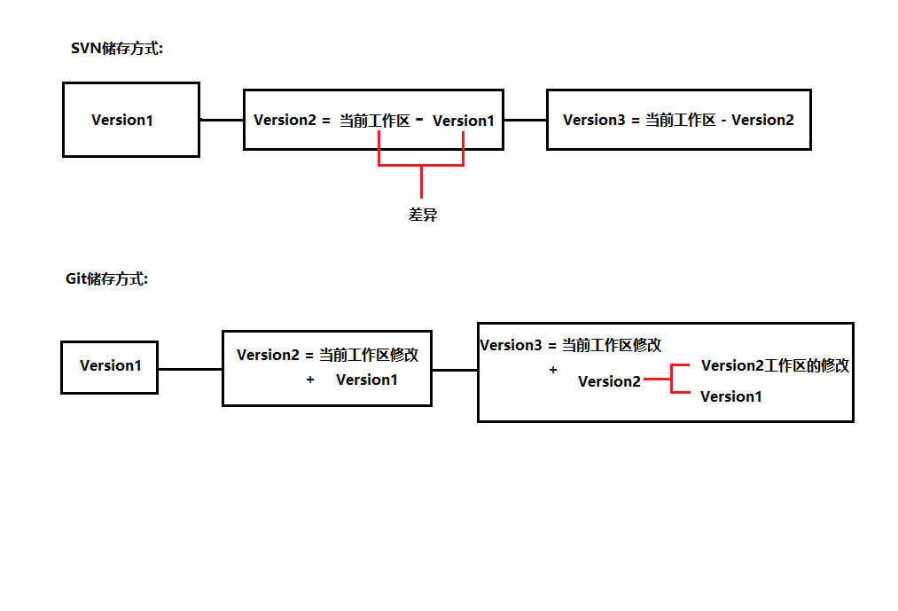

[toc]

# Git学习笔记

力求详细的记录Git在日常使用中所需要的操作


## 集中式管理 VS 分布式管理

集中式管理(以SVN为例)

优点: 
-  代码的版本记录存放在统一的服务器上, 有利于项目的管理
-  由于项目的版本控制是集中式储存与管理的, 更加方便代码仓库的权限进行配置
-  SVN服务器中存储的是版本(快照)之间的差异, 存储空间较小

缺点:
- 当服务器出现问题时, 轻则代码版本控制功能暂时无法使用, 重则整个项目的历史记录丢失只留下各个客户端中的最新版本
- 由于快照只储存差异, 所以回滚需要逐个快照进行比对, 速度慢


**SVN的机制描述**: 整个项目的历史快照都保存在服务器中, 而客户端只保存这项目当前最新快照, 所以当服务器出现故障时, 轻则导致由于服务器故障而暂时无法使用版本控制功能, 重则整个项目历史记录丢失, 就算恢复也只能恢复到客户端所拥有的最新快照


---


分布式管理(以Git为例)

优点:
- 每个客户端都储存着整个项目的所有历史快照, 只要客户端还有一个能用就能保证项目的数据(历史记录)不丢失
- Git的每次快照保存, 都是整个项目完整的快照保存, 回滚速度极快

缺点:
- 由于每个快照都是项目完整的历史记录, 所以储存空间会稍微大(但是由于极致的压缩算法空间占用还是很小)


**Git的机制描述**: 项目的完整历史快照(版本)保存在每个客户端中, 服务器也作为其中一个客户端, 每个快照都包含之前的快照以及新增的内容


---

svn与git的储存方式




---
---


## git仓库的文件结构


``` tree
│  config       -> 局部(local)的配置选项文件
│  description  -> 用于显示当前仓库的描述信息
│  HEAD         -> 指向当前所处分支的最新版本
│  logs         -> 保存日志信息, git reflog的信息从这读取
│  index        -> 文件保存暂存区的信息
│  
├─hooks         -> 目录包含客户端或服务端的钩子脚本
│      applypatch-msg.sample
│      commit-msg.sample
│      fsmonitor-watchman.sample
│      post-update.sample
│      pre-applypatch.sample
│      pre-commit.sample
│      pre-merge-commit.sample
│      pre-push.sample
│      pre-rebase.sample
│      pre-receive.sample
│      prepare-commit-msg.sample
│      push-to-checkout.sample
│      update.sample
│      
├─info          -> 包含一个全局性排除文件
│      exclude  -> 作用、用法与.gitignore一致, 不同的是它不会影响团队中的其他人(不上传), 只属于个人的配置
│      
├─objects       -> 存储所有数据, 十分重要
│  ├─info
│  └─pack
└─refs  -> 该目录存储着的文件对应不同的分支,文件内容是分支对应的提交对象的hash
    ├─heads
    └─tags
```


---


### 结构中的几个重点的解析

1. HEAD中指向的是refs中heads文件夹中的某个文件, 而heads文件夹中的每个文件代表一个分支, 所以==HEAD指向的是分支(默认是master)==
2. refs文件夹包含heads和tags两个子文件夹
   - heads中的每个文件代表着在git中创建的分支, 其内容是分支对应的最新commit hash
   - tags中每个文件代表着在git中创建的tag, 其内容是tag对应的commit hash
3. index储存着该分支下的所有数据, **除了切换分支外, 在当前分支中index是只增不减的**
4. objects中储存着在不同时期的各种对象, 可以是git对象(blob类型)、树对象(tree类型)、提交对象(commit-tree), 文件夹以hash前两位命名, 文件夹中的文件以hash第3位到最后命名
    1. 文件储存的内容就是每个对象对应的内容
    2. 提交对象的内容可以是提交对象、树对象和git对象
    3. 树对象的内容可以是树对象、git对象
    4. git对象的内容就是源代码、文件夹等


---
---


## git配置

对配置应用的位置说明

1. `git config --system`
    整个操作系统中所有用户都使用的配置, 配置文件在git安装目录下 `/etc/gitconfig`

2. `git config --global`
    该git配置只能被操作系统中的当前用户使用, 对应的配置文件在 `用户目录/.gitconfig`

3. `git config --local` 或 `git config`
    该git配置只能适用于当前git项目, 对应的配置文件在 `项目目录/.git/config`


**git配置的优先级**
local > global > system


==首次安装git环境必须配置个人信息, 之后git的版本更新将会自动沿用配置文件==


个人信息配置

``` shell
git config --配置位置 user.name "yourName"   # 在当前系统用户中配置git的用户名
git config --配置位置 user.email "yourEmail" # 在当前系统用户中配置git的邮箱
```


个人信息删除

``` shell
git config --配置位置 --unset user.name
git config --配置位置 --unset user.email
```

查询不同位置的配置信息

``` shell
git config --配置位置 --list, -l
git config --list, -l   # 查看所有位置的综合配置
```


---
---


### 常用的Linux命令

``` shell
clear                   # 清空控制台
tab                     # 自动补全
ctrl+u                  # 撤销当前输入
echo 'msg'              # 输出信息
echo 'msg' > test.txt   # 创建一个文件并将echo的内容添加进去
mkdir                   # 创建文件夹
cd                      # 切换路径
pwd                     # 显示当前所在路径
ls                      # 列出当前路径下所有文件
ll                      # 列出当前路径下所有文件及其详细信息
find 路径               # 列出当前路径及其子孙路径下所有文件与目录
find 路径 -type f       # 只列出当前路径及其子孙路径下所有文件
find 路径 -type -d       # 只列出当前路径及其子孙路径下所有文件夹
rm                      # 删除文件
mv                      # 重命名文件
cat                     # 查看文件内容
vim filename                    # 使用vim编辑器编辑文件

#####################  关于vim的简单编辑 ##################
i 进入编辑模式
按esc后输入:开始输入各种vim的指令(用于保存或退出vim编辑器)
    q! 表示不保存强制退出
    wq 表示保存后退出
    set nu 添加行号
```


---
---


## Git的三片区域和三种对象(Git底层命令)

区域:
- 工作区 Workplace
- 暂存区 StagePlace/Index/Cached
- 版本库 Repository

对象:
- git对象
- 树对象
- 提交对象


---


### git对象

- git对象
  1. 是Key-Value键值对
  2. Key是通过文件内容计算出的hash
  3. Value是文件内容
  4. git对象在git内部类型是一个blob类型

git对象用于以键值对的方式存储数据,是一个键值对数据库,==操作只涉及工作区==


---


生成git对象需要使用`git hash-object`命令
``` shell
echo "test" | git hash-object --stuin
git hash-object ./index.html
```

它还可以使用以下参数:

1. `--stdin`从标准输入流中获得value并计算出hash作为key, 需要配合echo使用
    ``` shell
    # 用法
    echo "test" | git hash-object --stdin   # | 是多个命令串行操作 相当于先执行echo 再执行 git hash-object
    ```

2. `-w`向git内部(.git/object/)中存入git对象
    ``` shell
    # 用法
    echo "test" | git hash-object -w --stdin
    ```

3. `文件路径(filePath)`用于代替`--stdin`作为计算hash的源内容
    ``` shell
    git hash-object ./index.html
    ```


---


git对象的key是根据内容进行计算的, 只要内容不变计算出的key(hash)永远不会变
``` shell
echo 'hello' | git hash-object --stdin
ce013625030ba8dba906f756967f9e9ca394464a

# 再次执行
echo 'hello' | git hash-object --stdin
ce013625030ba8dba906f756967f9e9ca394464a
```

每次对工作区的某个文件修改后进行`hash-object -w`都是对该文件进行版本控制
``` shell
git hash-object ./index.html # 7562b107f14951ffe
git hash-object ./index.html # aeafb9864cf43055a
```


---


使用以下命令能够查看git对象中存储的数据和git对象的类型

``` shell
git cat-file -p hash    # git对象中存储的数据
git cat-file -t hash    # git对象的类型 => blob类型
```


---


**git对象存在的问题:**
- 只能跟踪某个文件中内容的变化,而无法追踪多个文件的变化,所以不能成为整个项目的一次版本快照
- 记住繁杂的hash值不现实
- git中没有保存文件名, 而是hash值
- git对象只对应工作区中某一文件的改动不涉及暂存区


git对象只能代表单个文件的一次次版本快照,它不是整个项目的版本(它只能追踪单个文件)


---


### 树对象

树对象能够解决git对象只能用hash值而无法用文件名保存的问题, 更允许我们将多个文件组织在一起作为整个项目的一个版本快照,**树对象的操作涉及到暂存区**

树对象可以想象成文件夹,git对象可以想象成文件。==自然地, 树对象可以包含git对象和另一个树对象(称为子树对象)==


---


使用以下命令将文件保存到暂存区
``` shell
git update-index
```

它可以使用以下参数:
1. `--add` 如果当前git对象是首次加进暂存区中的则需要该参数, 暂存区是否已经添加依靠的是filename进行判断
2. `100644` 表示这是一个普通文件, 对应的其他文件模式还有: `100755可执行文件` `120000表示符号链接`
3. `--cacheinfo` 表示要添加的文件是一个git对象, 且位于git数据库中(.git/objects/)

    ``` shell
    git update-index --add --cacheinfo 100644 hash filename.ext
    # --add参数 表如果当前git对象是首次加进暂存区中的则需要该参数, 是否是首次添加进暂存区依靠filename进行判断
    # 100644  表示这是一个普通文件  对应的其他文件模式还有: 100755可执行文件 120000表示符号链接
    # --cacheinfo参数 表示要添加的文件位于git数据库中(是一个git对象)而不是当前目录下的一个文件
    ```


git对象形成树对象后放到暂存区中的两种方式:

``` shell
echo "文件内容" | 文件名 # 创建新文件
git update-index --add 文件名 # 自动先生成git对象, 再形成树对象

# 以上两步等价于
echo "文件内容" | 文件名 # 创建新文件
git hash-object -w 文件名  # 先生成git对象
git update-index --add --cacheinfo 100644 上一步git对象的对应的hash 文件名 # 形成树对象
```


`git update-index --add 文件名` **等价于高层命令的** `git add 文件名`


---


使用以下命令将暂存区中的所有内容形成一个树对象

``` shell
git write-tree # 运行成功后将会得到版本快照对应的hash
```
**执行git write-tree后不会清空暂存区**


查看树对象的类型和内容
``` shell
# 根据版本hash查看类型
git cat-file -t ff75343 # tree类型

# 根据版本hash查看类型
git cat-file -p ff75343 # 100644 blob ff75343fd58cff0477965bf65e2bab1e90fe1ab5 t.txt
```


---


查询暂存区状态
**注意:** 暂存区的文件始终是增量的(只会增加不会减少), ==除非到后面高层命令中切换分支,暂存区的文件才会依据分支相对增或减==

``` shell
git ls-files -s # 注意: 执行git write-tree后不会清空暂存区

git ls-files --deleted #查询待删除状态的文件, `git status`中为deleted状态的文件
```


对暂存区中已有的文件进行修改后, 暂存区不会新增对象, 而是覆盖已有对象

``` shell
echo "v1" > v.txt
git update-index --add ./v.txt
git ls-files -s
vim v.txt
git update-index --add ./v.txt
git ls-files -s


# ================= 或者 ===============

echo "v1" > v.txt
git hash-object -w ./v.txt # 626799f0f85326a8c1fc522db584e86cdfccd51f
git update-index --add --cacheinfo 100644 626799f0f85326a8c1fc522db584e86cdfccd51f v.txt
git ls-files -s
vim v.txt
git hash-object -w ./v.txt # 8c1384d825dbbe41309b7dc18ee7991a9085c46e
git update-index --cacheinfo 100644 8c1384d825dbbe41309b7dc18ee7991a9085c46e v.txt
git ls-files -s
```


以上操作等价于以下的git高层命令:

``` shell
echo "v1" > v.txt
git add ./v.txt
git ls-files -s
vim v.txt
git add ./v.txt
git ls-files -s
```
