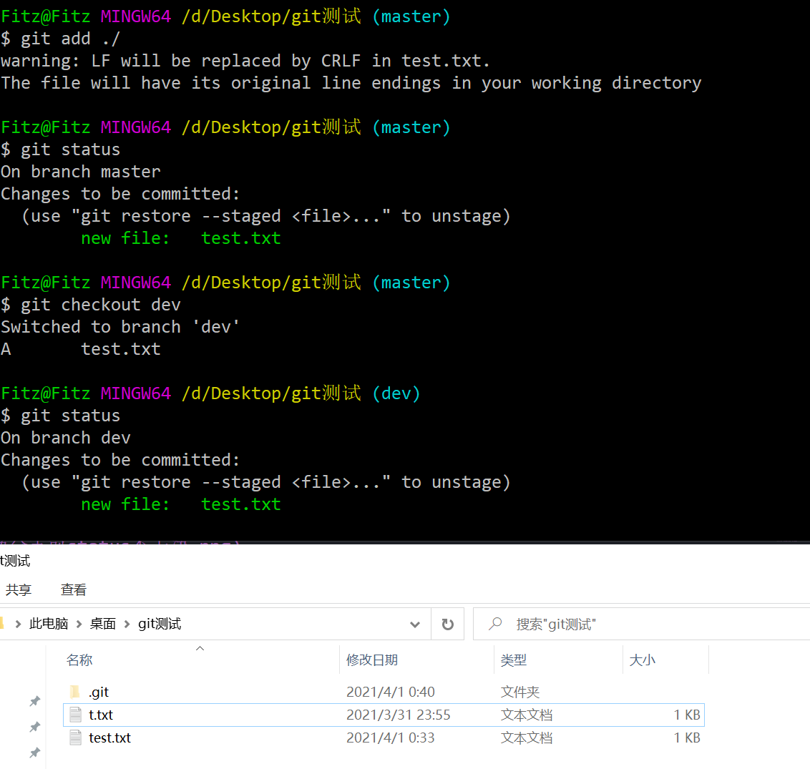
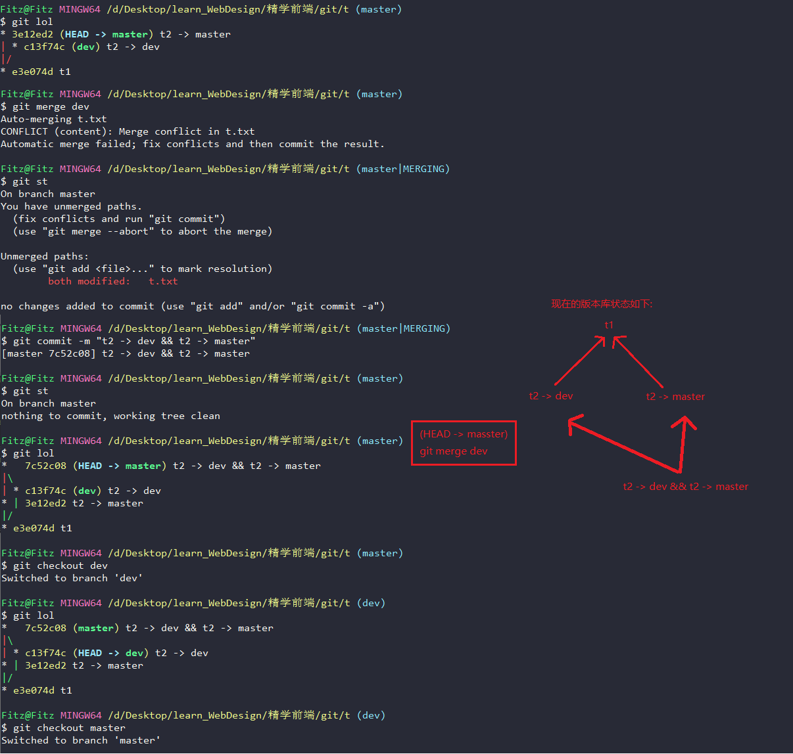
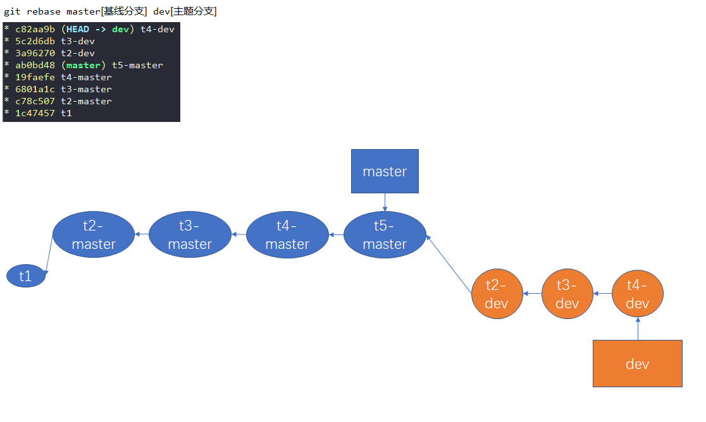
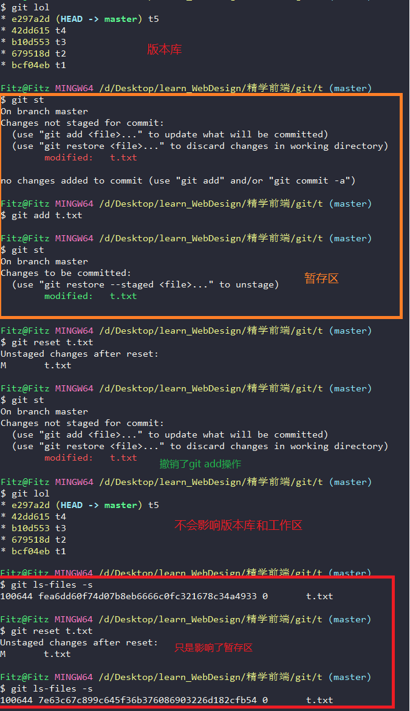
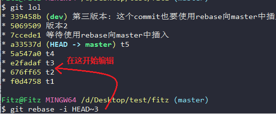
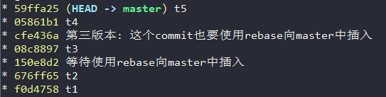
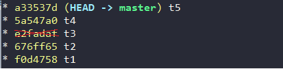

[toc]

# Git学习笔记

力求详细的记录Git在日常使用中所需要的操作


## 集中式管理 VS 分布式管理

集中式管理(以SVN为例)

优点: 
-  代码的版本记录存放在统一的服务器上, 有利于项目的管理
-  由于项目的版本控制是集中式储存与管理的, 更加方便代码仓库的权限进行配置
-  SVN服务器中存储的是版本(快照)之间的差异, 存储空间较小

缺点:
- 当服务器出现问题时, 轻则代码版本控制功能暂时无法使用, 重则整个项目的历史记录丢失只留下各个客户端中的最新版本
- 由于快照只储存差异, 所以回滚需要逐个快照进行比对, 速度慢


**SVN的机制描述**: 整个项目的历史快照都保存在服务器中, 而客户端只保存这项目当前最新快照, 所以当服务器出现故障时, 轻则导致由于服务器故障而暂时无法使用版本控制功能, 重则整个项目历史记录丢失, 就算恢复也只能恢复到客户端所拥有的最新快照


---


分布式管理(以Git为例)

优点:
- 每个客户端都储存着整个项目的所有历史快照, 只要客户端还有一个能用就能保证项目的数据(历史记录)不丢失
- Git的每次快照保存, 都是整个项目完整的快照保存, 回滚速度极快

缺点:
- 由于每个快照都是项目完整的历史记录, 所以储存空间会稍微大(但是由于极致的压缩算法空间占用还是很小)


**Git的机制描述**: 项目的完整历史快照(版本)保存在每个客户端中, 服务器也作为其中一个客户端, 每个快照都包含之前的快照以及新增的内容


---

svn与git的储存方式


---
---


## git仓库的文件结构


``` tree
│  config       -> 局部(local)的配置选项文件
│  description  -> 用于显示当前仓库的描述信息
│  HEAD         -> 指向当前所处分支的最新版本
│  logs         -> 保存日志信息, git reflog的信息从这读取
│  index        -> 文件保存暂存区的信息
│  
├─hooks         -> 目录包含客户端或服务端的钩子脚本
│      applypatch-msg.sample
│      commit-msg.sample
│      fsmonitor-watchman.sample
│      post-update.sample
│      pre-applypatch.sample
│      pre-commit.sample
│      pre-merge-commit.sample
│      pre-push.sample
│      pre-rebase.sample
│      pre-receive.sample
│      prepare-commit-msg.sample
│      push-to-checkout.sample
│      update.sample
│      
├─info          -> 包含一个全局性排除文件
│      exclude  -> 作用、用法与.gitignore一致, 不同的是它不会影响团队中的其他人(不上传), 只属于个人的配置
│      
├─objects       -> 存储所有数据, 十分重要
│  ├─info
│  └─pack
└─refs  -> 该目录存储着的文件对应不同的分支,文件内容是分支对应的提交对象的hash
    ├─heads
    └─tags
```


---


### 结构中的几个重点的解析

1. HEAD中指向的是refs中heads文件夹中的某个文件, 而heads文件夹中的每个文件代表一个分支, 所以==HEAD指向的是分支(默认是master)==, **版本的增加会带着HEAD移动, 而HEAD的移动会带着当前分支(指针)移动**
2. refs文件夹包含heads和tags两个子文件夹
   - heads中的每个文件代表着在git中创建的分支, 其内容是分支对应的最新commit hash
   - tags中每个文件代表着在git中创建的tag, 其内容是tag对应的commit hash
3. index储存着该分支下的所有数据, **除了切换分支外, 在当前分支中index是只增不减的**
4. objects中储存着在不同时期的各种对象, 可以是git对象(blob类型)、树对象(tree类型)、提交对象(commit-tree), 文件夹以hash前两位命名, 文件夹中的文件以hash第3位到最后命名
    1. 文件储存的内容就是每个对象对应的内容
    2. 提交对象的内容可以是提交对象、树对象和git对象
    3. 树对象的内容可以是树对象、git对象
    4. git对象的内容就是源代码、文件夹等


---
---


## git配置

对配置应用的位置说明

1. `git config --system`
    整个操作系统中所有用户都使用的配置, 配置文件在git安装目录下 `/etc/gitconfig`

2. `git config --global`
    该git配置只能被操作系统中的当前用户使用, 对应的配置文件在 `用户目录/.gitconfig`

3. `git config --local` 或 `git config`
    该git配置只能适用于当前git项目, 对应的配置文件在 `项目目录/.git/config`


**git配置的优先级**
local > global > system


==首次安装git环境必须配置个人信息, 之后git的版本更新将会自动沿用配置文件==


个人信息配置

``` shell
git config --配置位置 user.name "yourName"   # 在当前系统用户中配置git的用户名
git config --配置位置 user.email "yourEmail" # 在当前系统用户中配置git的邮箱
```


个人信息删除

``` shell
git config --配置位置 --unset user.name
git config --配置位置 --unset user.email
```

查询不同位置的配置信息

``` shell
git config --配置位置 --list, -l
git config --list, -l   # 查看所有位置的综合配置
```


---
---


## 常用的Linux命令

``` shell
clear                   # 清空控制台
tab                     # 自动补全
ctrl+u                  # 撤销当前输入
echo 'msg'              # 输出信息
echo 'msg' > test.txt   # 创建一个文件并将echo的内容添加进去
mkdir                   # 创建文件夹
cd                      # 切换路径
pwd                     # 显示当前所在路径
ls                      # 列出当前路径下所有文件
ll                      # 列出当前路径下所有文件及其详细信息
find 路径               # 列出当前路径及其子孙路径下所有文件与目录
find 路径 -type f       # 只列出当前路径及其子孙路径下所有文件
find 路径 -type -d       # 只列出当前路径及其子孙路径下所有文件夹
rm                      # 删除文件
mv                      # 重命名文件
cat                     # 查看文件内容
vim filename                    # 使用vim编辑器编辑文件

#####################  关于vim的简单编辑 ##################
i 进入编辑模式
按esc后输入:开始输入各种vim的指令(用于保存或退出vim编辑器)
    q! 表示不保存强制退出
    wq 表示保存后退出
    set nu 添加行号
```


---
---


## Git的三片区域和三种对象(Git底层命令)

区域:
- 工作区 Workplace
- 暂存区 StagePlace/Index/Cached
- 版本库 Repository

对象:
- git对象
- 树对象
- 提交对象


---


### git对象

- git对象
  1. 是Key-Value键值对
  2. Key是通过文件内容计算出的hash
  3. Value是文件内容
  4. git对象在git内部类型是一个blob类型

git对象用于以键值对的方式存储数据,是一个键值对数据库,==操作只涉及工作区==


---


生成git对象需要使用`git hash-object`命令
``` shell
echo "test" | git hash-object --stuin
git hash-object ./index.html
```

它还可以使用以下参数:

1. `--stdin`从标准输入流中获得value并计算出hash作为key, 需要配合echo使用
    ``` shell
    # 用法
    echo "test" | git hash-object --stdin   # | 是多个命令串行操作 相当于先执行echo 再执行 git hash-object
    ```

2. `-w`向git内部(.git/object/)中存入git对象
    ``` shell
    # 用法
    echo "test" | git hash-object -w --stdin
    ```

3. `文件路径(filePath)`用于代替`--stdin`作为计算hash的源内容
    ``` shell
    git hash-object ./index.html
    ```


---


git对象的key是根据内容进行计算的, 只要内容不变计算出的key(hash)永远不会变
``` shell
echo 'hello' | git hash-object --stdin
ce013625030ba8dba906f756967f9e9ca394464a

# 再次执行
echo 'hello' | git hash-object --stdin
ce013625030ba8dba906f756967f9e9ca394464a
```

每次对工作区的某个文件修改后进行`hash-object -w`都是对该文件进行版本控制
``` shell
git hash-object ./index.html # 7562b107f14951ffe
git hash-object ./index.html # aeafb9864cf43055a
```


---


使用以下命令能够查看git对象中存储的数据和git对象的类型

``` shell
git cat-file -p hash    # git对象中存储的数据
git cat-file -t hash    # git对象的类型 => blob类型
```


---


**git对象存在的问题:**
- 只能跟踪某个文件中内容的变化,而无法追踪多个文件的变化,所以不能成为整个项目的一次版本快照
- 记住繁杂的hash值不现实
- git中没有保存文件名, 而是hash值
- git对象只对应工作区中某一文件的改动不涉及暂存区


git对象只能代表单个文件的一次次版本快照,它不是整个项目的版本(它只能追踪单个文件)


---


### 树对象

树对象能够解决git对象只能用hash值而无法用文件名保存的问题, 更允许我们将多个文件组织在一起作为整个项目的一个版本快照,**树对象的操作涉及到暂存区**

树对象可以想象成文件夹,git对象可以想象成文件。==自然地, 树对象可以包含git对象和另一个树对象(称为子树对象)==


---


使用以下命令将文件保存到暂存区
``` shell
git update-index
```

它可以使用以下参数:
1. `--add` 如果当前git对象是首次加进暂存区中的则需要该参数, 暂存区是否已经添加依靠的是filename进行判断
2. `100644` 表示这是一个普通文件, 对应的其他文件模式还有: `100755可执行文件` `120000表示符号链接`
3. `--cacheinfo` 表示要添加的文件是一个git对象, 且位于git数据库中(.git/objects/)

    ``` shell
    git update-index --add --cacheinfo 100644 hash filename.ext
    # --add参数 表如果当前git对象是首次加进暂存区中的则需要该参数, 是否是首次添加进暂存区依靠filename进行判断
    # 100644  表示这是一个普通文件  对应的其他文件模式还有: 100755可执行文件 120000表示符号链接
    # --cacheinfo参数 表示要添加的文件位于git数据库中(是一个git对象)而不是当前目录下的一个文件
    ```


git对象形成树对象后放到暂存区中的两种方式:

``` shell
echo "文件内容" | 文件名 # 创建新文件
git update-index --add 文件名 # 自动先生成git对象, 再形成树对象

# 以上两步等价于
echo "文件内容" | 文件名 # 创建新文件
git hash-object -w 文件名  # 先生成git对象
git update-index --add --cacheinfo 100644 上一步git对象的对应的hash 文件名 # 形成树对象
```


---


`git update-index --add **文件名`**操作的是暂存区**

``` shell
git hash-object -w 文件名
git update-index --add --cacheinfo 100644 hash 文件名

# 等价于该git底层命令 ↓
git update-index --add 文件名

# 等价于该git高层命令 ↓
git add 文件名
```


---


使用以下命令将暂存区中的所有内容形成一个树对象

``` shell
git write-tree # 运行成功后将会得到版本快照对应的hash
```
**执行git write-tree后不会清空暂存区**


查看树对象的类型和内容
``` shell
# 根据版本hash查看类型
git cat-file -t ff75343 # tree类型

# 根据版本hash查看类型
git cat-file -p ff75343 # 100644 blob ff75343fd58cff0477965bf65e2bab1e90fe1ab5 t.txt
```


---


关于暂存区的文件对象:

**注意:** 暂存区的文件始终是增量的(只会增加不会减少), ==除非到后面高层命令中切换分支,暂存区的文件才会依据分支相对增或减==, 暂存区中同名的文件对象会被新的覆盖而不是增加


---


查询暂存区状态

``` shell
git ls-files -s # 注意: 执行git write-tree后不会清空暂存区

git ls-files --deleted #查询待删除状态的文件, `git status`中为deleted状态的文件
```


对暂存区中已有的文件进行修改后, 暂存区不会新增对象, 而是覆盖已有对象

``` shell
echo "v1" > v.txt
git update-index --add ./v.txt
git ls-files -s
vim v.txt
git update-index --add ./v.txt
git ls-files -s


# ================= 或者 ===============

echo "v1" > v.txt
git hash-object -w ./v.txt # 626799f0f85326a8c1fc522db584e86cdfccd51f
git update-index --add --cacheinfo 100644 626799f0f85326a8c1fc522db584e86cdfccd51f v.txt
git ls-files -s
vim v.txt
git hash-object -w ./v.txt # 8c1384d825dbbe41309b7dc18ee7991a9085c46e
git update-index --cacheinfo 100644 8c1384d825dbbe41309b7dc18ee7991a9085c46e v.txt
git ls-files -s
```


以上操作等价于以下的git高层命令:

``` shell
echo "v1" > v.txt
git add ./v.txt
git ls-files -s
vim v.txt
git add ./v.txt
git ls-files -s
```


---


将一个树对象添加进暂存区中,然后构建生成一个新的树对象中(形成父子树对象)

``` shell
git read-tree --prefix=foo 子树对象的hash # 自定义的prefix将作为暂存区中的标识(与filename作用一致), 在工作区中表现是生成一个以prefix命名的文件夹, 内部包含该子树对象的内容
git write-tree # 完成树对象嵌套
```


---


树对象存在的问题:
- **的确是项目的一个版本**, 但是作为版本快照, 树对象的信息不明确, 无法获得该快照的保存时间、原因、作者


总结： 树对象可以追踪多个文件对象的内容的变化(git对象、树对象), 同时还能将对象保存到暂存区中(操作暂存区), 然后再某个时机需要的时候形成整个项目的版本快照, **每一个树对象都是一次完整的版本快照**


---
---


### 提交对象


使用以下命令创建提交对象

1. 当首次创建提交对象时
    ``` shell
    # 方式1
    echo 本次提交需要的说明 | git commit-tree 树对象hash
    # 方式2
    git commit-tree 树对象hash -m 本次提交需要的说明
    ```


2. 当再次创建提交对象时,还需要额外指定父提交对象, 这样在查看提交对象的信息时就能知道其父提交对象是谁
    ``` shell
    # 方式1
    echo 本次提交需要的说明 | git commit-tree 树对象hash -p 父提交对象的hash
    # 方式2
    git commit-tree 树对象hash -m 本次提交需要的说明 -p 父提交对象的hash
    ```


总结: 提交对象是对树对象进行包裹后再添加进一些关于树对象的信息(作者、提交时间等), 这一步只是对树对象的进一步美化而已, 所以**每一个树对象都是一个完整的项目版本, 提交对象仅比树对象多了说明信息**


---
---


## 找到一个commit对象的几种方式

1. 通过HEAD指针进行相对引用
    ``` shell
    git reset HEAD # 当前分支指向的最新的commit
    git reset --hard HEAD^ # 上一个提交对象 
    git reset --hard HEAD~2 # 上n个提交对象 
    ```
2. 通过commit对象的hash进行绝对引用
    ``` shell
    git reset --hard e2fadaf # 代表hash值为e2fadaf的提交对象
    ```


---


### 找到第二个父提交对象

`merge`三方合并后会产生两个父提交对象, 虽然可以使用hash的方式来"强行"找到, 但还可以使用HEAD


但是`HEAD^`只能找到第一个父提交对象


如果要找到第二个父提交对象需要语法`HEAD^2`


---
---


## git常用的高层命令

``` shell
git init        # 初始化git仓库
git add         # 将文件纳入git跟踪
git status      # 查看git状态
git diff [--cached, staged, hash] # 比较两个区域间文件差异
git log         # 查看项目版本
git relfog      # 查看项目的所有历史操作
git commit [-a] [-m 注释]   # 创建项目版本
```


---


`git add`添加文件至暂存区(staged)


``` shell
git add */文件/目录   # 将工作区的修改提交到暂存区(具体流程: 工作区修改后转变成git对象->先到版本库->再版本库到暂存区)

# 以上命令等价于执行
git hash-object -w 文件/目录 # 将文件放进git版本库(.git/objects)中成为git对象
git update-index [--add] --cacheinfo 文件/目录 # 将git对象从版本库提取然后放进暂存区中
# 或等价于执行
git update-index --add 文件/目录
```


---


`git commit [-a] [-m 注释]`将暂存区的文件提交到版本库,形成一个版本快照

``` shell
git commit -m '注释内容'

# 以上命令等价于执行
git write-tree  # 生成树对象得到hash值
echo '注释内容' | git commit-tree 树对象的hash值

git commit -a -m  # 当暂存区中已经有相同名字的文件时, 使用该命令可以跳过git add直接commit到版本库, 等价于 git add + git commit
git commit  # 使用vim为当前版本书写详细的log说明
```


---


`git commit --amend [--no-edit]`将暂存区形成一个提交对象去替换最新的一次版本, 而不是让版本数增加

``` shell
git commit --amend # 将暂存区最近一次更新提交, 但是不会生成新的版本(提交对象), 用于修改最新一次版本
git commit --amend --no-edit # 沿用旧版本的log说明
```

示例: 当最新的版本对象出现==文件漏提交或添加了不应该的文件时==
``` shell
#最佳实践:
# 第1步: 操作当前的工作区直到满意
# 第2步: 替换最新的版本快照(提交对象)
git commit --amend
```


---


`git status`查看git当前所处状态


git管理目录下文件的状态分类

- 未跟踪(Untracked)
    

- 已跟踪(tracked)
  1. 已暂存(staged)
    
  2. 已修改(modified)
    
  3. 已删除(deleted)
    
  4. 已提交(commited)
    


---


`git diff [--cached, staged, hash]` 比较两个区域间文件差异
``` shell
# 工作区与暂存区比较
git diff

# 暂存区与版本库比较
git diff --cached
git diff --staged

# 工作区与版本库比较
git diff HEAD/hash值
```


---


`git mv oldFileName newFileName`文件重命名

普通方式重命名文件
``` shell
mv oldFileName newFileName # Linux下的文件重命名
git add newFileName # 将文件的变化(命名变化)提交到暂存区
git commit -m ''        # 将重命名操作提交到版本库

# ============== 重命名文件相当于执行了一下这些操作 ===============
#   1. rm删除掉旧的文件
#   2. 创建新的文件
#   3. 将旧文件中的内容添加进新文件
```


使用`git mv`简化操作
``` shell
git mv oldFileName newFileName # git下的文件重命名
# git mv 相当于 => mv + git add
git commit -m ''  # 将重命名后的文件从暂存区提交到版本库
```


---


普通方式删除文件
``` shell
rm 文件 # 使用linux命令删除文件
git add ./  # 将文件的修改(删除)添加进暂存区
git commit -m ''
```


使用`git rm`简化操作

``` shell
git rm 文件
git commit -m ''
```


命令`git rm --cached`只会删除当前版本中暂存区的对应文件, 不会删除工作区和其他版本, ==用于解决: 有时候想把某些目录或文件加入.gitignore, 但是添加后发现并未生效(没有被git忽略)原因是.gitignore只能忽略那些原来没有被tracked的文件, 如果文件已经被纳入了版本管理中则修改.gitignore是无效的==, 示例:

``` shell
# 解决方法:
git rm [-r] --cached file   # 对于目录要添加-r参数, 表示递归删除
git add ./
git commit -m ""
```


---


`git log`查看版本快照的提交记录

``` shell
git log     # 打印详细的版本提交记录
git log --pretty=oneline    # 打印hash详细、其他信息简略的版本提交记录
git log --oneline   # 打印7位数hash、其他信息简略的版本提交记录
git reflog  # 当bash窗口关闭后又需要调出以前的版本提交记录时使用
```


---
---


## git分支

分支的思想: 
假如突然需要为项目添加一个新的功能, 为了源代码的安全最佳实践应该是: 将项目完整的复制一份然后在复制的项目中编写新功能, 而不是直接在原项目中编写新功能代码


分支的原理:
创建一个新的分支指针指向某个提交对象, 该分支此时的暂存区就是这个提交对象的暂存区状态。往后修改、增加文件只会更新当前分支的暂存区然后形成新的提交对象, 不会影响其他分支的任何东西。形成新的提交对象时, HEAD指针会带着分支指针移动。


切换分支快的原因:
所有分支的暂存区中, 没有变动的文件都引用着同一blob对象, 只有变动的文件git才会重新生成新的blob对象去替换暂存区中的


**分支指针总是指向该分支下最新的提交对象, 切换分支本质上是切换HEAD指针去指向某个分支指针, HEAD指针既能指向某个分支指针又能直接指向某一提交对象(head detached模式)**


查看所有分支
``` shell
git branch
```


创建分支
``` shell
git branch 分支名 #创建分支
git branch 分支名 hash # 创建一个分支并使该分支指向特定的提交对象
```

切换分支

``` shell
git checkout 分支名 # 切换分支
```


创建&切换分支

``` shell
git checkout -b 分支名 # 创建并切换分支(简化操作)
git checkout -b 分支名 hash # 创建并切换分支并使该分支指向特定的提交对象(简化操作)
```

创建一个没有任何历史(父提交)的分支

``` shell
git checkout --orphan=分支名
```


删除分支

``` shell
# 删除分支需要先切换到其他分支
git branch -d 分支名 # 用于删除已经合并过的分支
git branch -D 分支名 # 强制删除分支,一般是由于分支没合并但是不再需要
```


重命名分支, 可以直接在要修改的分支上进行
``` shell
git branch -m 分支名 # 改名会在重名时取消
git branch -M 分支名 # 强制改名, 出现重名分支是会覆盖掉
```


查看每个分支的最后一次提交
``` shell
git branch -v
```


强制修改分支指向, ==修改前需要切换到其他分支==
``` shell
git branch -f 分支名 hash, HEAD~n
```

1. 当分支已存在时, 会将该分支强制指向指定的提交对象, 其操作相当于在当前分支下执行`git reset --hard`


2. 当分支不存在时会创建该分支然后指向该提交对象, 其操作等价于`git branch 分支名 hash/HEAD~n`


**关于切换分支的最佳实践:** 每次在切换分支前, 使用`git status`确保当前分支是干净的, 原因: 

首先我们要知道切换分支意味着3个操作:
- 修改HEAD的指向即:将HEAD指针切换到对应分支
  
- 修改暂存区
  
- 修改工作目录
  
  


---


假如当前分支不是干净的, 切换会导致两种情况发生 **(坑爹所在)**

1. 当前的文件从未添加到过版本库中, 则无论是`Untracked`还是`Staged`都会使得该文件被带入到要切换到的分支中(污染要切换的分支)



2. 当前文件已经是添加到过版本库的(Tracked), 此时修改文件, 状态只能是`Modified`, 则git会阻止我们进行分支切换


---


### 合并分支(merge、rebase)

查看所有已经合并过的分支
``` shell
git branch --merged
```


查看所有未合并过的分支, 删除这样的分支需要使用`git branch -D`
``` shell
git branch --no-merged
```


合并分支(merge版)
``` shell
git merge 分支
```




merge合并分支示例:


merge合并分支的特点:
1. merge合并分支会产生新的提交对象, 这个提交对象是会**有两个父提交对象**
    
2. merge合并的方法是将两个分支的最新版本以及二者的最近共同祖先版本进行三方合并
    


[合并分支(rebase版)](https://git-scm.com/book/zh/v2/Git-%E5%88%86%E6%94%AF-%E5%8F%98%E5%9F%BA)

**重要说明:** 这种rebase方式仅适合分支之间已经分叉开, [对于分支间的提交树是直的时请看下面的rebase方式](#对于版本线是直的时使用rebase合并分支的方法)


``` shell
# 将开发分支上的所有修改"复制并续到"基线分支上
git checkout 开发分支
git rebase 基线分支

# 等价于
git rebase 基线分支 开发分支
```


``` shell
# 示例1:
git checkout bugFix
git rebase main # 将bugFix所做的所有修改在main中应用(续到main上)

# 示例2:
git rebase main bugFix  # 不用切换到bugFix分支, 直接将bugFix所做的所有修改在main中应用
```


**rebase合并分支的步骤**(基线分支为master, 主题分支为experiment):

1. 找到两个分支最近的祖先版本(最后分叉的地方)
    
2. 获得主题分支在最近祖先版本后的每一个版本(例子中仅有C4版本), 保存为临时文件
    
3. 将主题分支指向基线分支的最新版本
    
4. 将第2步保存的所有版本逐个续在当前主题分支指向的版本之后, 期间需要处理多次冲突, 处理次数为第2步所保存的版本的个数
    
5. 如果想让基线分支包含主题分支的修改, 只需要进行一次fast-forward模式的merge合并即可
    ``` shell
    git checkout master
    git merge experiment
    ```
    


rebase合并分支的特点:
1. 修改版本的分叉点(branch out)
    
    
    
2. 导致主题分支丢失掉原分叉点前的版本历史
    
3. 主题分支中每个版本的hash都将改变
    


---


#### 对于版本线是直的时使用rebase合并分支的方法

版本线是直的情况下, 一般优先选择使用`git merge`, 然后利用Fast-forward模式进行合并, 但是如果一定要使用rebase就不能像上面那样了


**正确方法应该是: 直接在需要更新的分支上rebase, 这样分支指针只会简单的移动**
``` shell
# 当前在main分支上, 它需要得到bugFix的所有新commit
git rebase bugFix
```

上述操作等价于:

``` shell
git rebase bugFix main
```


---


### 因分支合并产生冲突后git的几种模式

1. Fast-Forward模式: 不同分支之间文件的内容只是单纯增减(版本线是直的), git会将分支指针直接移动到`git merge`中指定的分支所指向的那个提交对象上


2. --no-ff模式: 对于可以使用Fast-forward模式的合并, 可以人为的使用`--no-ff`参数去禁止使用Fast-forward合并, **区别:** --no-ff模式会新增一个版本(提交对象), Fast-forward模式不会, 但是代码等内容是完全一致的
    ``` shell
    git merge --no-ff branch
    ```
    


3. Auto-merging模式: 当两个分支都修改了文件中的(至少)同一处时, git首先会尝试进行合并, 如果无法自动合并时就会产生改成冲突


---


### 使用cherry-pick将其他分支的commit"复制"到当前分支中

命令:
``` shell
git cherry-pick hash1 [hash2 hash3]
```


示例:
1. 分别从feature分支和dev分支挑选一个commit, "复制"到master分支中
    
    
2. 解决冲突并`git add`暂存后, 使用`cherry-pick --continue`完成cherry-pick或者继续解决下一个冲突
    
3. 在删除其他分支(减少干扰)后, 最终可以看到两个commit被成功"复制"到了master分支中
    


---
---


## 配置别名

当遇到难记、冗长的命令时,可以通过为命令配置别名的方式来简化操作


创建别名
``` shell
git config --位置 alias.别名 '命令'  
```


删除别名(2种方式)
1. 命令方式 **常用**
  ``` shell
  git config --配置位置 --unset alias.别名
  ```
  

2. 去对应位置的config配置文件中将对应的alias删掉
  ``` shell
  git config --配置位置 --edit
  ```
  


---


示例:

``` shell
git status # 原命令
git config --global alias.st 'status' # 在全局配置中将 git status 别名简化成 git st
git config --global alias.st status # 内置的变量名称可以不加引号

git commit -m '' # 原命令
git config --local alias.gcm 'commit -m'
# 运行gcm '注释' 等价于执行 git commit -m '注释'
```


==为大家推荐几个好用的命令==

``` shell
git config --global alias.lol "log --oneline --decorate --graph --all"
git config --global alias.lg "log --color --graph --all --pretty=format:'%Cred%h %Cblue=>%C(auto)%d %Creset%s %Cgreen(%cr) %C(bold blue)<%an>%Creset' --abbrev-commit"
git config --global alias.amend "git commit --amend --no-edit"
```


---
---


## Git暂时隐藏工作区

假如在一个分支上工作到一半突然需要紧急切换到另一个分支,但是又不想因为需要切换到目标分支而将当前未完成工作的分支创建一次提交对象(作为一个版本)时,就可以是用`git stash`命令


`git stash`命令会将暂存区中未完成的修改保存到一个栈上
``` shell
git stash # 将当前分支上的暂存区内容先隐藏起来
```


查看隐藏工作区的所有记录
``` shell
git stash list # 查看所有的stash(查看stash栈中的情况)
```

当做完工作回到开发时的(隐藏工作区的)分支上后,可以使用以下命令将隐藏的工作区释放出来继续进行开发

``` shell
git stash apply # 应用栈顶的隐藏工作区, 不会删除git stash记录, 后续需要git stat drop
git stash apply stash@{num} # 应用特定的git stash记录, 不会删除git stash记录, 后续需要git stat drop
git stash drop stash@{num} # 删除特定的git stash记录

git stash pop   # 应用栈顶的隐藏工作区,会删除git stash记录
# pop = apply + drop
```


`git stash`冲突的发生:
将stash释放后, 如果与当前HEAD指向的版本修改了文件的同一处时, 就会发生冲突


`git stash`总结:
1. 当前分支中没有任何版本时, 无法使用`git stash`
    
2. 暂存区不干净时, 无法使用`git stash pop/apply`释放
    
3. 当释放stash后与当前版本发生冲突时, 即使使用的是`git stash pop`对应的stash也不会被删除而是自动保留着
    


---
---


## git时光机

git中有三片区域(workSpace, staged, repository), git时光机就是==将对应区域的文件退回到指定的版本和另一区域==


### 文件从工作区回退(撤销工作区的修改)

使用以下命令回退:
``` shell
git checkout -- filename
```


工作区: 撤回工作目录中的文件修改,分为以下两种情况:
1. 假如只修改工作区还没add,则撤销回最近的提交对象
2. 假如 首次修改工作区 -> add进暂存区 -> 再次修改工作区,则撤销回到工作区首次修改的状态
    ``` shell
    vim test.txt    # 首次修改工作区
    git add test.txt #将修改添加进暂存区中
    vim test.txt    # 再次修改工作区
    git checkout -- test.txt #这一次撤销将回到 <首次修改工作区> 的状态
    ```


**工作区回退原理:** 用暂存区(`git ls-files -s`)中的文件对象覆盖工作区


---


### 将工作区和暂存区回退到指定版本

使用以下命令将工作区和暂存区回退到指定版本, 运用了下面描述的路径reset原理: 
`checkout --`本来是回退工作区的, 但是由于指定了特定的版本, git必须要从版本库中提取commit对象, 所以:
1. 版本库不变
2. 工作区与暂存区回退到指定版本

即: **改变暂存区和工作区, 版本库都不会改变**

命令:
``` shell
git checkout [hash] filename
```


---


### 撤销对文件的git add操作

使用以下命令撤销对某个文件的`git add`操作, 利用的是下面所讲的路径reset原理:
``` shell
git reset [HEAD] filename

# 等价于下面该命令:
git reset --mixed HEAD filename
```




---


#### 路径reset原理(包含撤销暂存区到指定版本)

``` shell
# 路径reset
git reset [--mixed] hash filename
```

原理: `--mixed`模式本来是回退版本库和暂存区, 但是由于指定了特定的文件回退, git不可能由于一个文件要回退而将整个版本回退, 所以:
1. 版本库不变
2. 暂存区回退到指定版本
3. 工作区不变
即: **只改变暂存区, 工作区和版本库都不会改变**


路径reset的类型有两种:
1. checkout版
    ``` shell
    git checkout hash filename
    ```


2. reset版
    ``` shell
    git reset [--mixed] hash filename
    ```


---


### git reset --soft回退版本库

命令:
``` shell
git reset --soft hash
```

描述这种模式的回退:
1. 单纯的回退版本库
2. 工作区和暂存区不会被改变
3. 由于工作区和暂存区是一致的, 所以此时文件是staged状态的


---


### git reset --mixed回退版本库与暂存区

命令:
``` shell
git reset [--mixed] hash
```

描述这种模式的回退:
1. 回退版本库与暂存区
2. 工作区不会被改变
3. 工作区和暂存区不一致的, 此时文件是modified状态


---


### git reset --hard回退版本库、暂存区、工作区

命令:
``` shell
git reset --hard hash
```

描述这种模式的回退:
1. 回退版本库、暂存区、工作区
2. ==这个模式是危险的==, 它会强制使用版本库覆盖工作区和暂存区, **工作区中还没有 git add 过的文件会丢失**


---


### git revert回退版本库、暂存区、工作区(常用于远程仓库的回退)

命令:
``` shell
git revert hash
```


描述这种模式的回退:
1. 回退版本库、暂存区、工作区
2. 这种回退不会删除提交, 而是继续增加提交, 但是该提交的实际内容与回退到的内容一致
    
3. revert后面的hash与reset的不一样, **revert最好的理解方式是从哪个地方开始撤销**
    
    以上图为例:
    回退到t4, 则需要从`a33537d`开始恢复, 所以应该`git revert HEAD`
    回退到t2, 则需要从`e2fadaf`开始恢复, 所以应该`git revert e2fadaf`

**如果工作区中是不干净的, git会拒绝执行revert, 所以revert是安全的**


---


### 总结分支切换、reset时光机、路径reset所操作的区域与指针对象

分支切换操作了:
1. HEAD指针
2. 工作区


---


`git reset --soft`操作了:
1. HEAD指针
2. 分支指针


---


`git reset --mixed`操作了:
1. HEAD指针
2. 分支指针
3. 暂存区


---


`git reset --hard`操作了:
1. HEAD指针
2. 分支指针
3. 暂存区
4. 工作区


---


撤销工作区修改操作了:
1. 工作区


---


checkout版路径reset操作了:
1. 工作区
2. 暂存区


---


reset版路径reset操作了:
1. 暂存区


---
---


## 修改当前提交对象(git commit --amend)

作用: 使用该命令可以重新commit暂存区, 但是**不会产生新的提交对象, 而是覆盖当前最新的提交对象**, 并且可以选择是否修改提交对象的commit log, **注意: 修改需要先git add再使用该命令**


命令:
``` shell
git commit --amend # 需要修改commit log
git commit --amend --no-edit # 使用原来的commit log
```

使用场景:
1. 当发现自己的commit log写错了可以该命令去重新修改
2. 当前的commit中缺少了文件或者不想让新的修改增加一个版本时可以使用该命令


---
---


## rebase修改提交对象与提交对象树

在当前分支上commit树是不断进行增长的, 对于以下这些场景git提供了命令用于编辑提交对象, 甚至整个提交对象树:
1. 向commit树中插入一些commit
2. 删除commit树中的某个commit
3. 更改某个commit的提交日志、代码
4. 合并commit树中的某些commit(squash版本)
5. 合并commit树中的某些commit(fixup版本)
6. 修改某个commit的提交日志


使用到的命令:
``` shell
git rebase <-i, --interactive> hash
git rebase <-i, --interactive> --root # 直接从根commit开始编辑
```
使用该命令进入编辑后常用的一些参数
``` shell
p, pick <commit>    # 使用提交
r, reword <commit>  # 修改提交日志
e, edit <commit>    # 修改提交日志与当前提交的代码
s, squash <commit>  # 将当前提交与最近的上一次提交合并
f, fixup <commit>   # 与"squash"类似, 但是会直接使用最近的上一次提交的日志
d, drop <commit>    # 删除该提交对象
```


---


下面就开始对以上提到的4种场景进行演示:

场景1: 将独立的本地分支dev中的第1、3个commit分别插入到master分支的第2与第3版本之后(**向commit树中插入一些commit**)


步骤1: 去到commit树中正确的位置


步骤2: 开始编辑commit树, 注意关键字的选择


步骤3: 修改commit之间的冲突


步骤4: 解决冲突后使用`git add`将修改暂存
步骤5: 使用`git rebase --continue`完成rebase或者继续解决下一个冲突


场景1的commit树最终如下



---


场景2: 删除第3个commit(删除commit树中的某个commit)


步骤1: 去到commit树中正确的位置


步骤2: 开始编辑commit树, 注意关键字的选择


步骤3: 修改commit之间的冲突


步骤4: 解决冲突后使用`git add`将修改暂存
步骤5: 使用`git rebase --continue`完成rebase或者继续解决下一个冲突


场景2的commit树最终如下


---


场景3: 第3个commit中添加一行代码(更改某个commit的提交日志、代码)


步骤1: 去到commit树中正确的位置


步骤2: 开始编辑commit树, 注意关键字的选择


步骤3: 编辑代码


步骤4: 等所有的代码修改到满意后使用`git add`将修改暂存
步骤5: 然后使用`git rebase --continue`完成rebase或者继续解决下一个冲突

场景3的commit树最终如下


---


场景4: 第3与第4个commit(合并commit树中的某些commit{squash版本})


步骤1: 去到commit树中正确的位置


步骤2: 开始编辑commit树, 注意关键字的选择, squash会与最近的commit进行合并所以要有前一次的commit存在


场景4的commit树最终如下


---


场景5: 第3与第4个commit(合并commit树中的某些commit{fixup版本})


步骤1: 去到commit树中正确的位置


步骤2: 开始编辑commit树, 注意关键字的选择, fixup会与最近的commit进行合并, **并且会直接使用最近commit的提交日志, 这意味着fixup关键字的所有commit将丢失提交日志**


场景5的commit树最终如下


---


场景6: 修改t3的提交日志(修改某个commit的提交日志)


步骤1: 去到commit树中正确的位置


步骤2: 开始编辑commit树, 注意关键字的选择, **一定要选择reword关键字, 直接编辑提交日志是不成功的**


场景6的commit树最终如下


---


### 总结rebase修改提交对象与提交对象树的步骤
1. `git rebase -i`去到commit树中正确的位置
2. 开始编辑commit树, 注意关键字的选择
3. 修改commit之间的冲突
4. 解决冲突后使用`git add`将修改暂存
5. 使用`git rebase --continue`完成rebase或者继续解决下一个冲突


---


### 通过命令显式提交 还是 依赖rebase --continue带来的隐式提交？

在rebase修改提交树的过程中, 如果有冲突就需要去解决, 解决冲突并`git add`将修改暂存后, 就会面临一个问题: 显式的使用命令如`git commit -m`或`git commit --amend`来提交呢, 还是依赖执行`git rebase --continue`后自动提交? **我的建议是: 依赖--continue** , 因为它会智能的选择使用amend还是直接commit, 不会出现因为使用amend导致提交对象树与预期不符

这里演示: 错误的使用amend使得少了两个commit


通过隐式提交使得最大概率保证commit树符合预期


---
---


## 为提交对象打Tag

Git可以给历史的提交对象打上tag表示项目中一些重要的节点

打标签
``` shell
git tag 标签名  # 为当前最新的提交对象打上标签
git tag 标签名 hash    # 为特定提交对象创建标签
```

删除标签
``` shell
git tag -d 标签名   # 删除标签
```

列出所有标签
``` shell
git tag [-l]        # 列出所有标签
```


为标签添加说明信息
``` shell
git tag 标签名 -a  # 需要进入编辑器进行编辑
git tag 标签名 -m "msg" # 说明信息直接传入
```


强制将一个存在的标签指向新的提交对象
``` shell
git tag -f 标签名 hash
```


查看对象的详细信息, 对象类型可以是文件、git对象、树对象、提交对象、标签
``` shell
git show 标签名     # 展示标签对应的提交对象的详细信息
```


将标签推送至远程仓库, 标签创建后默认只会留在本地, 如果需要推送到远程仓库中需要显式地进行推送
``` shell
git push 远程主机别名 标签名 # 推送特定的标签
git push origin --tags  # 一次性推送所有远程仓库中没有的标签
```


在本地删除标签后, push也不会更新到远程仓库, 删除远程仓库中的标签需要以下特定命令显式
``` shell
git push origin :refs/tags/标签名
```


---


### 头部分离模式(HEAD Detached)


切换标签: 可以去到特定的tag或提交对象中进行试验或文件的查看, 好处是不用创建一条多余的分支，, 它的原理与切换分支相似, 就是将HEAD指针指向标签指针
``` shell
git checkout 标签名 #切换标签
```

切换标签会出现头部分离模式,即HEAD不指向任何分支


**头部分离模式的使用场景:** 当我们需要去往特定的历史提交对象中做一些小实验验证我们想法时, `git checkout hash/tag`过去然后在那做实验, ==如果实验成功就原地创建分支保存想法然后merge==, 如果实验失败也不用管可以直接`git checkout`其他分支, git会"丢弃"掉失败的尝试, 当然这个丢弃是可恢复的可以随时`git branch 分支名 实验commit的hash`来重新建立分支找回这个失败的分支


示例:
假如我们需要到t3这个提交对象中进行一些实验, 用来验证想法

实验中进行了一些提交

假如实验需要放弃, 直接切换到普通分支即可, git会给出刚刚实验的所有提交(此时可以忽略)

后续需要找回实验的内容, 只需要在实验的提交中创建分支再merge即可, 实验的提交可以在`git reflog`中找到


---


### git describe查看某一commit的最近tag的描述信息

前提是: 这个tag是要有描述信息的(`git tag 标签名 -m "msg"`), 否则会报错: fatal: No annotated tags can describe

命令:
``` shell
# tag有描述信息使用这个
git describe hash

# tag没有描述信息使用这个
git describe --tags hash
```


返回值:
``` shell
# 标准
<tag>_<numCommits>_g<hash>
# 解读后
<最近的tag名>_<tag与当前相差几个coomit>_g<当前commit的hash>
```


---
---


## git远程仓库协助开发

github协同开发支持使用https和ssh两种方式:

- https的优点:
  1. 不用专门生成秘钥
  2. 匿名性
  3. 端口默认是打开的无需操心
- https的缺点:
    1. 传输速度相对慢一些
    2. 每次都需要输入用户名与密码


- ssh的优点:
  1. 推送与拉取不用输入用户名与密码
  2. 传输速度快
- ssh的缺点:
    1. 使用前需要专门生成秘钥


---


### 使用ssh进行协同开发

当Github与本地之间需要通过ssh的方式进行加密通讯时, 由于这种传输方式是需要秘钥来支撑服务的, 所以需要我们在最开始使用时先去生成秘钥


先在用户主目录下, **看看有没有.ssh目录**, 如果有再看看这个目录下有没有`id_rsa`和`id_rsa.pub`这两个文件


==如果没有.ssh或者目录文件缺失,就需要我们手动生成秘钥==
``` shell
ssh-keygen [-o] -t rsa -C "个人的邮箱地址" # 如果想在使用秘钥时需要密码, 添加-o参数使得私钥的保存格式更加安全, 但是一般不需要
```


然后将`id_rsa.pub`复制到Github --> Settings --> SSH and GPG keys --> New SSH key


---


#### 在一台电脑上使用多个ssh-keys

1. 通过命令生成密钥
    ``` shell
    ssh-keygen -t rsa -C "个人的邮箱地址"
    ```
2. 添加私钥, 如果执行`ssh-add`时提示: ==Could not open a connection to your authentication agent==, 则先执行`ssh-agent bash`
    ``` shell
    ssh-add 第1步中密钥保存的位置
    ```
3. 检查密钥是否添加成功
    ``` shell
    ssh-add -l # 私钥
    ssh-add -L # 公钥
    ```
4. 去gitee或github中添加密钥
   
5. 使用命令查看是否能成功通过平台验证
    ``` shell
    ssh -T git@gitee.com
    ssh -T git@github.com
    ```
6. 删除某个ssh-key使用以下命令
    ``` shell
    ssh-add -d 密钥位置/密钥文件名(一般为id_rsa) # 删除特定的密钥, 不会删除本地的密钥文件
    ssh-add -D # 直接清空所有ssh-keys凭证, 下次使用需邀再次添加, 但是不会删除本地的密钥文件
    ```


**注意:** `ssh-add`命令不是用来永久性的记住你所使用的私钥的, 实际上它的作用只是把你指定的私钥添加到`ssh-agent`所管理的一个session中, 而`ssh-agent`是一个用于存储私钥的临时性的session 服务, 也就是说当你重启`git bash`之后ssh-agent服务也将被重置, 下次再使用需要重新进行上面2-6步


---


### 使用https协同开发

当向远程仓库push出现类似以下报错时, 说明没有权限向仓库中推送代码


windows对于使用https的方式可以通过以下方式解决:
1. 打开凭据管理器删除对应平台的凭据
    
2. 执行`git push`命令等待输入token或者用户名密码
3. 对于token, 生成方式如下:
   - Setting > Developer settings > Personal access tokens
4. 能够正常推送


---


### 克隆仓库

命令:
``` shell
# 可选项: 本地项目名 可以用来重命名从远程克隆下来的项目, 如果不指定将用仓库地址中.git前面的命名名作为本地项目名
git clone 仓库的地址 [本地项目名]
```


---


### 远程协同开发中的几种分支的概念
1. 本地分支: 就是在开发时使用的普通分支

2. 远程跟踪分支: 
   1. 这种分支也位于本地
   2. 命名方式为: `服务器别名/远程分支名`
   3. 它不能在本地的人为的操作、移动, 而是在拉取远程服务器的更新后自动移动
   4. **该分支是本地分支与远程分支沟通的桥梁、渠道**

3. 远程分支: 位于服务器中的一条普通分支

4. 跟踪分支
   1. 它不是一条真实的分支而是一种分支的存在形式, 可以看作是本地分支与远程跟踪分支紧密结合
   2. 本地分支通过命令与远程跟踪分支"绑定" 或者 本地分支从远程跟踪分支上生成 这两种情况下就会形成, 可以认为: `跟踪分支 = 本地分支 + 远程跟踪分支`
   3. **跟踪分支的作用: 可以使用`git push`、`git pull`命令简化代码的推送与拉取**


---


#### 远程跟踪分支

第一次向远程仓库中推送它没有的新分支时, 远程仓库就会生成远程分支, 本地就会生成远程跟踪分支

``` shell
# 完整写法
git push 主机别名 本地分支名:远程分支名

# (常用)简写写法
# 注意: 这种写法下本地分支将和远程分支同名
git push 主机别名 本地分支名

# 示例1
git push origin dev:awesome # 本地生成远程追踪分支 origin/awesome   远程仓库中生成远程分支 awesome
# 示例2
git push origin dev # 本地生成远程追踪分支 origin/dev   远程仓库中生成远程分支 dev
```


---


场景: 小组成员1删除了远程仓库的issue分支, 隔了段时间不明情况的小组成员2想看看远程分支issue有没有好玩的东西,结果一pull发现报错:远程分支不存在。 一问其他人才发现该远程分支早就被删了, 于是在本地执行该命令删掉本地不再有用的远程跟踪分支


当远程分支被成员删除时, 其他成员的电脑中, **本地的远程跟踪分支依然存在(fetch也不影响)**, 需要通过以下这些命令查询/清除本地的无用的远程跟踪分支(远程分支已被删除)

查看本地所有无用的远程跟踪分支, 这个命令只是查看不会删除
``` shell
git remote prune -n 主机别名
git remote prune --dry-run 主机别名
```

清除本地中无用远程跟踪分支
``` shell
git remote prune 主机别名 
```


---


fetch拉取远程的包括远程分支、代码的更新到本地, 更新可在远程跟踪分支中查看或直接用本地分支与其merge
``` shell
git fetch <仓库别名> # 全量获取整个远程仓库(所有分支)
git fetch <仓库别名> <远程分支名> # 获取远程仓库特定分支的更新
```


让远程分支像`git pull`那样直接更新到本地分支, 不影响远程跟踪分支,  **并且本地分支可以与远程分支不同名**
``` shell
git fetch <仓库别名> <远程分支名>:<本地分支名>

# 示例1: 将远程分支dev的更新直接更新到本地分支dev中
git fetch origin dev:dev    # 此操作类似于 git pull origin dev

# 示例2: 将远程分支dev的更新直接更新到本地分支feature中
git fetch origin dev:feature
```


---


##### fetch 与 pull 的区别

可以简单的认为: `pull = fetch + merge`

示例: 执行`git pull origin main`相当于:
    
1. git fetch origin main
    
2. git merge main (==当前在bar分支==)
    


---


#### 远程分支

删除远程分支(常用)
``` shell
git push <主机别名> -d, --delete <远程分支名>
```


删除远程分支(另类方式)
``` shell
git push <主机别名> :<远程分支名>
```


---


##### 关于origin/HEAD分支

`origin/HEAD`也是本地的远程跟踪分支, 它指向一条远程分支


git支持修改默认的远程分支的指向
``` shell
git remote set-head 主机别名 -a, --auto # 根据远程库当前指向自动确定
git remote set-head 主机别名 -d, --delete # 删除远程库的默认分支
git remote set-head 主机别名 本地分支名 # 将分支设为远程库的默认分支
```


根据[git-remote documentation](https://git-scm.com/docs/git-remote)中对`set-head`的解释: 假如使用`set-head`命令指定了远程默认分支是dev, **则以后origin就等于origin/dev**


示例:


---


#### 跟踪分支

新创建一个远程仓库然后推送本地分支时, 本地会创建出远程跟踪分支, 但是本地分支不会与远程跟踪分支绑定形成跟踪分支(即使是master分支也不会), 需要手动将二者绑定后才能形成, 否则后面的推送还是需要以`git push 主机别名 本地分支名`的形式进行推送


---


如果克隆下来一个仓库, 本地会自动创建出所有的远程跟踪分支, 但是本地分支只会有默认分支一条, 一般为master, 并且该分支已经是跟踪分支


---


将已有的本地分支与远程跟踪分支"绑定", 使其变成跟踪分支  **此操作需要本地分支 与 远程跟踪分支都已经存在, 否则报错**
``` shell
git branch --set-upstream-to=远程跟踪分支 本地分支

# 以上命令可简写为
git branch -u 远程跟踪分支 本地分支
# 如果已经在目标的本地分支上则可以进一步忽略指定本地分支, 直接写远程跟踪分支
git branch -u 远程跟踪分支
```


---


根据远程跟踪分支生成一个新的本地分支并绑定为跟踪分支  **此操作需要远程跟踪分支存在, 但是不需要本地分支存在**
``` shell
git branch 本地分支名 --track, -t 远程跟踪分支 # 根据远程跟踪分支创建本地分支(跟踪分支)
git checkout -b 本地分支 --track, -t 远程跟踪分支  # 根据远程跟踪分支创建并切换到本地分支(跟踪分支)
```


---


==在首次推送到远程仓库时==, 可以将已有的本地分支在push时添加参数使其变成跟踪分支  **此操作需要本地分支存在, 但是不需要远程跟踪分支存在**

``` shell
git push --set-upstream 仓库别名 本地分支名

# 以上命令可简写为
git push -u 仓库别名 本地分支名
```


---


本地分支与远程分支不同名在`pull与push`时的情况: ==原本跟踪分支就是为了简化推送与拉取的操作, 但是如果本地分支与远程分支不同名, 即使有了跟踪分支推送与拉取也无法简化==


---


取消跟踪分支(解除本地分支与远程跟踪分支的绑定)

``` shell
git branch --unset-upstream <本地分支名> # 取消跟踪分支
```


---


##### 总结跟踪分支
``` shell
git push -u origin dev
# 等价于以下这些两条命令
git push origin dev # 创建远程分支 & 创建远程跟踪分支
git branch -u origin/dev dev # 将本地分支dev 与 本地远程跟踪分支dev 关联形成跟踪分支

# 对应的非简写写法
git push --set-upstream origin dev
# 等价于以下这些两条命令
git push origin dev
git branch --set-upstream-to=origin/dev dev
```


---


#### 远程协作中的冲突解决

产生冲突的情况有两种, ==分别发生在本地与远程库的push和pull操作==:

情况1(push操作): 成员1、成员2在本地各自修改同一文件A, 其中一成员向远程库成功推送, 当另一成员也向远程库推送时, 冲突情况1发生

成员1修改本地的t.txt文件, 并向远程推送成功


成员2也对本地的t.txt文件进行修改, 修改完毕在推送时就会发生冲突


**冲突情况1解决方法:** 后面需要push的成员需要先将远程库的更新进行拉取, 解决完对应文件产生的冲突后, 就能正常推送了


---


情况2(pull操作): 成员1在本地编辑文件A并向远程库提交了, 成员2同时在文件A上做任务但是进行到一半时, 发现该任务需要依赖成员1做出的修改, 这就需要成员2在编辑过程中拉取更新到本地, 但是由于成员2的代码与成员1的在编辑行数上有重合, 于是冲突发生

成员1在本地修改文件A并已经向远程库提交


成员2也在文件A上做任务但是这个任务需要依赖成员1对文件A做出的修改


**冲突情况2解决方法:** 将本地的修改暂时stash起来或直接commit掉, 然后拉取远程库更新后进行冲突手动解决, 之后就能正常推送了


---


#### 远程仓库相关的所有命令(集合)

生成秘钥:
``` shell
ssh-keygen -t rsa -C "个人的邮箱地址"
```

关联远程仓库:
``` shell
git remote add 主机别名 仓库地址
```


本地解除与远程仓库的关联:
``` shell
git remote remove 主机别名
```

远程仓库重命名
``` shell
git remote rename 旧别名 新别名
```


查看主机别名
``` shell
git remote      # 查看远程仓库别名
git remote show # 查看远程仓库别名
```


查看主机别名与仓库地址
``` shell
git remote -v
```

查看远程仓库详细信息
``` shell
git remote -v show 主机别名
```

将本地分支推送到仓库, 本地形成远程跟踪分支, 仓库形成远程分支
``` shell
# 完整写法
git push 主机别名 本地分支名:远程分支名
# 简写写法
git push 主机别名 本地分支名
```

查看本地分支是否为跟踪分支
``` shell
git branch -vv
```

删除远程分支, 即使在本地删除了远程开发分支或者与其同名的本地分支也不会影响到远程分支, 删除远程分支需要使用命令显式删除
``` shell
git push 主机别名 --delete 远程分支名
git push 主机别名 -d 远程分支名
```


拉取远程仓库的代码和远程分支的更新
``` shell
git fetch <仓库别名> # 全量获取整个远程仓库(所有分支)
git fetch <仓库别名> <远程分支名> # 获取远程仓库特定分支的更新
git fetch <仓库别名> <远程分支名>:<本地分支名> # 获取远程仓库特定分支的更新直接更新到本地分支(远程和本地分支可以不同名), 不会更新远程跟踪分支
```


根据远程跟踪分支创建本地分支, 并让二者绑定成为跟踪分支
``` shell
git branch --set-upstream-to=远程跟踪分支 本地分支

# 以上命令可简写为
git branch -u 远程跟踪分支 本地分支
git branch -u 远程跟踪分支
```


将本地分支推送到仓库, 从而创建远程分支和远程跟踪分支, 并让本地分支和远程跟踪分支绑定成为跟踪分支
``` shell
git push --set-upstream 仓库别名 本地分支名

# 以上命令可简写为
git push -u 仓库别名 本地分支名
```


根据远程跟踪分支生成一个新的本地分支并绑定为跟踪分支
``` shell
git branch 本地分支名 --track, -t 远程跟踪分支 # 根据远程跟踪分支创建本地分支(跟踪分支)
git checkout -b 本地分支 --track, -t 远程跟踪分支  # 根据远程跟踪分支创建并切换到本地分支(跟踪分支)
```

取消跟踪分支
``` shell
git branch --unset-upstream <本地分支名> # 取消跟踪分支
```

获取远程仓库的更新到同名的本地分支
``` shell
git pull <主机别名> <远程分支名>
```

获取远程仓库的更新并直接更新到不同名本地分支, 不会影响远程跟踪分支
``` shell
git pull <主机别名> <远程分支名>:<本地分支名>
```


---
---


## Pull Request的使用

当我们在遨游github/gitee开源世界时,如果发现一些好玩的项目。我们可能就会想弄下来自定义一下

那怎么弄下一个库来就很简单、自然了
``` shell
git clone <远程仓库地址> [仓库重命名]
```

但是这样子有个显著的问题: ==当我们对弄下来的库做了一番自定义修改后想要push进远程库时,会提示我们没有权限==。这是因为我们clone的库是别人团队的,我们在没有收到邀请成为团队成员的情况下,当然不能使用push等增删改仓库代码的操作, 要是每个人都能这样不就天下大乱了吗~~


---


于是为了能够对仓库有完整的权限操作,最简单的办法就是: 

1. clone别人的项目仓库
2. 把clone下来的本地仓库(目录)的`.git`文件夹删掉
3. 然后`git init`初始化仓库
4. 一顿`git add`等操作后
5. 在自己的github/gitee账号下创建远程仓库后, 将该已经"私有化"的项目push上去,这样以后我们就能随意修改啦


可是这样未免太麻烦了, 于是github/gitee为我们提供了能够迅速克隆复制出一份别人项目副本到自己账号下的功能, 叫Fork, 中文名也叫: 派生


github Fork


gitee Fork


测试使用Fork(以github为例)


---


能够自定义修改开源项目只是派生的其中一个功能,开源运动今天之所以能够运行的如火如荼与派生的另一功能Pull Request有很大的关系。它能够让一众高手对一个项目进行添砖加瓦,==所有人都能将对项目的进行修改后向项目所有者提Pull Request==,从而让项目能够更好地发展


当派生出的项目中的代码被修改后就会显示可以向源项目提出Pull Request


项目作者可以看到别人提的Pull Requests


在PR页面可以采纳别人的代码或者跟别人在线互怼?


到这就完成了一次Pull Request了


---


开源作者甚至能够向曾经提出Pull Request的人请求支援


PR在Merge前可以被随时关闭和打开


项目作者能不能关闭(操作)PR取决于你提PR时允不允许项目拥有者操作
**要是项目作者关闭了PR就意味着pull request被拒绝了**


---


### Pull Request的正确流程总结
1. Fork想要做出贡献的项目
2. 将已经Fork到自己仓库的项目拉下来, 此时对该项目同时拥有拉取和推送权限
3. 在本地同时也关联想要贡献的项目, 用于之后随时查看项目是否有更新
    ``` shell
    git remote add contribute 想要贡献的项目的地址
    ```
4. 修改代码并推送到自己的远程仓库
5. **每次发出Pull Request前都需要做:** fetch拉取想要贡献的项目, 确保与项目是最新的且没有任何冲突
    ``` shell
    git fetch contribute
    ```
6. 发出Pull Request等待回应


---
---


## git使用经验

1. 多使用`git add`, 这样能够在commit次数尽量少的情况下, 保证文件的最大限度安全, 因为每次`git add`除了将文件存入暂存区, 还会在存入前为每个文件生成blob(git)对象, 最终我们能够实现将某一个文件单独回退到某一版本
    ``` shell
    # 1. 使用git stash将当前工作暂时冻结
        git stash
    # 2. 强制回退到某一文件满意时所在的版本
        git reset --hard hash
    # 3. 将该文件的内容另存为单独一个文件
    # 4. 回退到stash需要的版本
    # 5. 解除工作区的冻结
        git stash pop
    # 6. 使用命令计算该文件的hash
        git hash-object filename
    # 7. 回退暂存区中该文件的版本
    git update-index --cacheinfo 100644 上一步的hash filename
    # 8. 使用命令回退工作区
        git checkout -- filename
    # 成功实现特定文件的版本回退
    ```

    
    
    
    
    单独回退某一文件的版本, 以t.txt为例:
    
    


---


2. `rebase`只在私人的开发分支上使用, 永远不在多人的开发分支上使用, 因为rebase会使得主题分支的提交历史丢失。 **注意: 多人开发分支是指多个人一起在同一条分支上开发, 而不是多个人能看到的某一条分支(以master为例)**
    ``` shell
    git rebase 基线分支 主题分支 # 主题分支在rebase后提交历史将部分丢失掉
    ```


